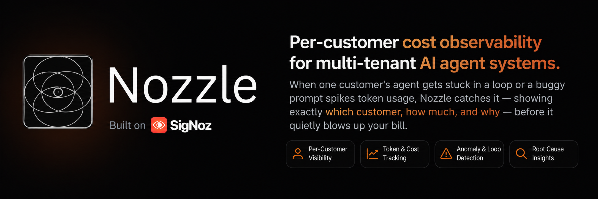

# Per-Customer AI Cost Radar

<p align="center">
  
</p>

Hackathon demo for attributing AI spend to individual customers and surfacing anomalies with SigNoz.

## SigNoz Field Requirements

This repo is structured to match the SigNoz hackathon checklist:

- Use Foundry to install SigNoz and the MCP server.
- Commit `casting.yaml` at the repo root.
- For the demo, prefer `casting.mcp.yaml` so the MCP server is enabled by default.
- Commit `casting.yaml.lock` after running `foundryctl forge` or `foundryctl cast` on your machine.
- Use SigNoz traces, query/aggregation, dashboards, and alerts in the demo flow.
- Keep the deployment reproducible so judges can rerun Foundry from a clean clone.
- See [docs/foundry-runbook.md](D:/nozzle/docs/foundry-runbook.md) for the exact command sequence.

## Quick Start

1. Start SigNoz locally. See [docs/signoz-setup.md](D:/nozzle/docs/signoz-setup.md).
2. Configure `backend/.env` from `backend/.env.example`.
3. Install and run the backend:
   ```powershell
   cd backend
   py -3 -m pip install -r requirements.txt
   py -3 -m uvicorn app.main:app --reload --host 0.0.0.0 --port 8001
   ```
4. Install and run the frontend:
   ```powershell
   cd frontend
   npm install
   npm run dev
   ```

## One Command

Run both apps together from the repo root:

```powershell
.\run-dev.ps1 -OpenBrowser
```

## Demo Flow

- Open the frontend at `http://localhost:5173`
- Pick a customer
- Click `Trigger Spike`
- Watch the summary and incident panel update as the backend emits real traces

## SigNoz Features Used

- Traces for live OpenRouter and tool spans
- Query-based aggregation for per-customer spend
- Anomaly detection endpoints for alerts
- MCP-ready SigNoz deployment via Foundry

## Reproducibility Note

`casting.yaml` is committed in the repo. `casting.yaml.lock` must be generated by Foundry on a machine with SigNoz access and then committed as well; it is not safe to hand-write that file.
